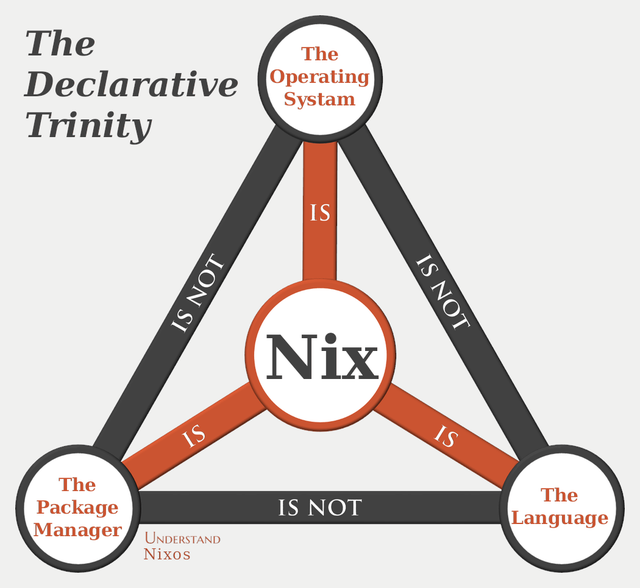
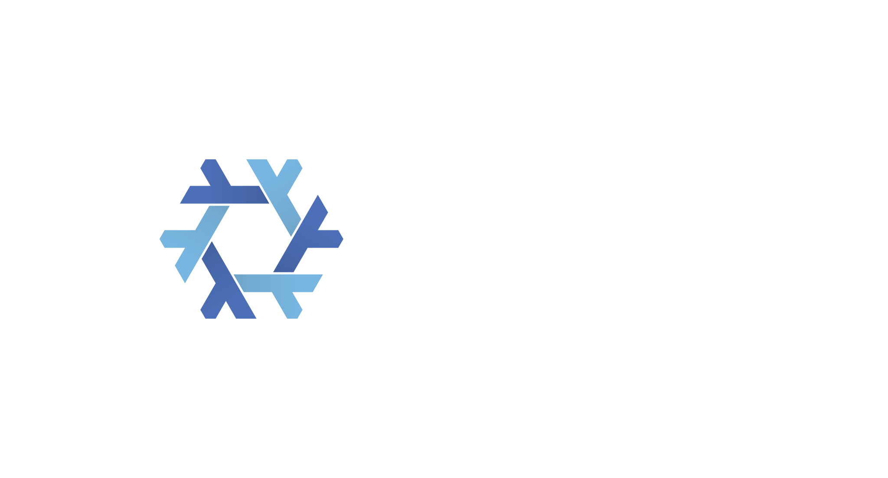
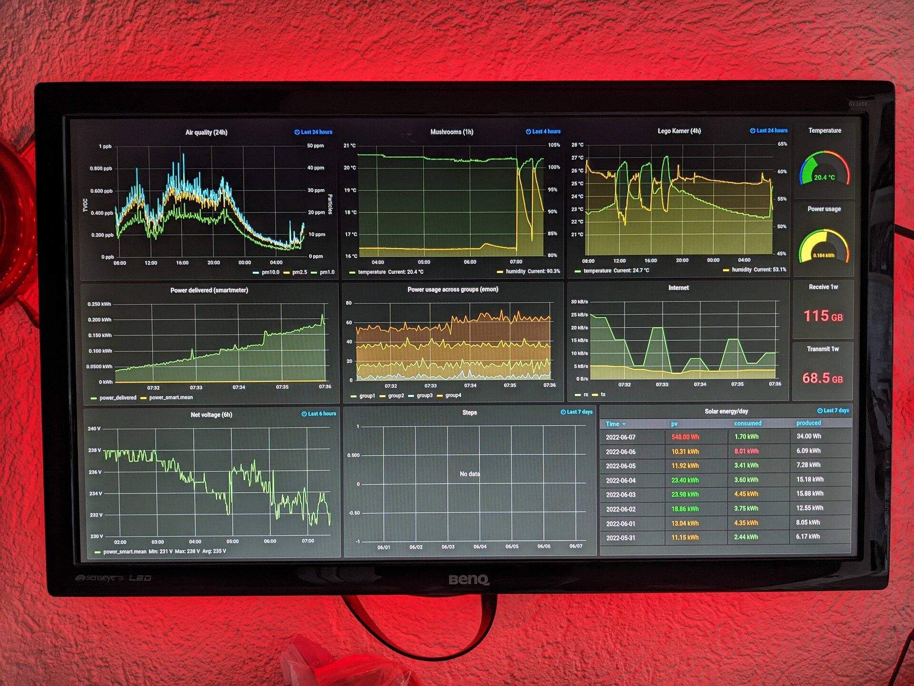
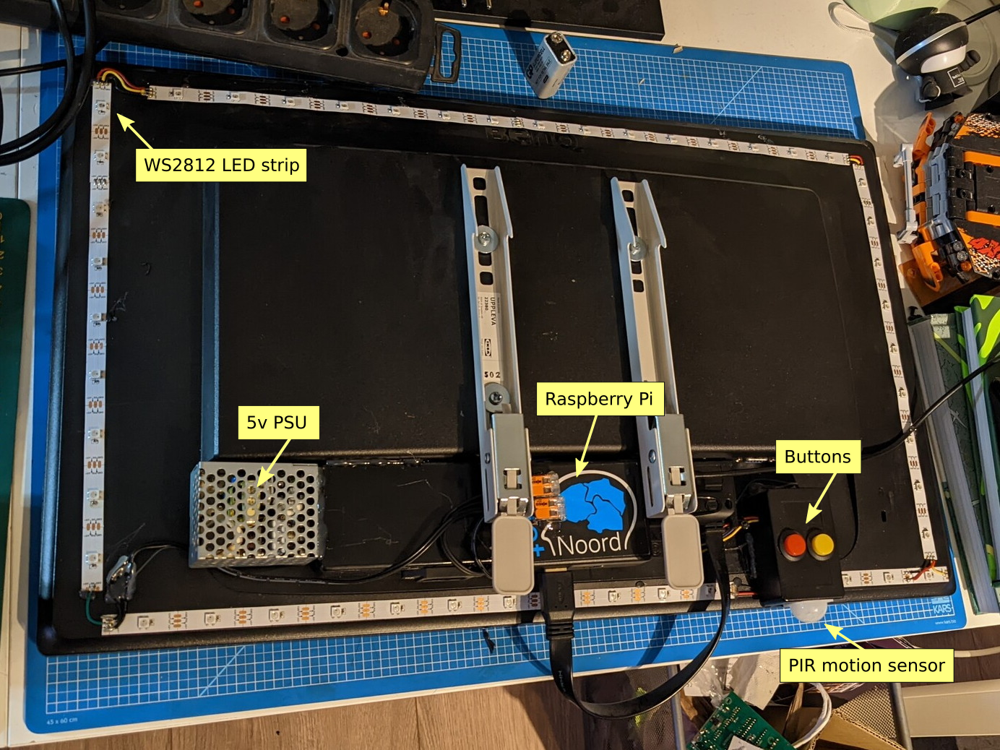
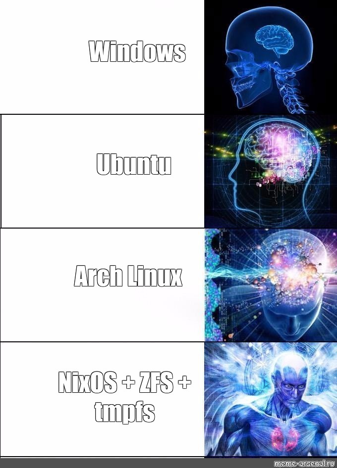

#+OPTIONS: num:nil date:nil toc:nil
#+REVEAL_ROOT: https://cdn.jsdelivr.net/npm/reveal.js
#+REVEAL_EXTRA_SCRIPT_BEFORE_SRC: https://cdn.jsdelivr.net/npm/reveal.js/plugin/notes/notes.js
#+REVEAL_INIT_OPTIONS: history:true, plugins: [RevealNotes]
#+REVEAL_PLUGINS: (marked markdown zoom notes)
#+REVEAL_TRANS: slide
#+REVEAL_THEME: black
#+REVEAL_EXTRA_CSS: custom.css
#+Title: An Introduction to Nix(OS)
#+Subtitle: Cloud Native Groningen Meetup
#+Author: Jos van Bakel
#+Email: jos@codeaddict.org
#+Date: 2026-05-21

#+REVEAL_TITLE_SLIDE_BACKGROUND: ./images/nix.svg
#+REVEAL_TITLE_SLIDE_BACKGROUND_SIZE: 50%
#+REVEAL_TITLE_SLIDE: <h1 class="title">%t</h1>
#+REVEAL_TITLE_SLIDE: <h2 class="author">%a</h2>

# Documentation: https://github.com/yjwen/org-reveal/

# for different Themes see:
# https://revealjs.com/?transition=none#/themes

# press 's' for the speaker notes.

* About me

- Jos van Bakel
- Platform engineer at Voys
- NixOS user since 2018
- https://github.com/c0deaddict

* Agenda

#+ATTR_REVEAL: :frag (appear)
- Why
- What is Nix?
- What is NixOS?
- Pros and Cons
- My setup
- Getting started

#+begin_notes
Before we begin:
- Ask questions at any time
- Check font readability of Emacs and terminal
#+end_notes

* Why

#+ATTR_REVEAL: :frag (appear)
- I've been tinkering with Linux systems for ~25 years.
- Tried many distributions: RedHat, Gentoo, Ubuntu, Mint, Arch.
- All became an unmaintained mess over time.

#+begin_notes
I've been tinkering with Linux systems for about 25 years.
I've tried many distributions: RedHat, Gentoo, Ubuntu, Mint, Arch.
I like to customize and try out new things.
Upgrading these systems was always a pain.
#+end_notes

** Problems

#+ATTR_REVEAL: :frag (appear)
- Forget how systems are configured
- Hard to customize core system processes
- Hard to package custom software
- Configuration files are all over the place
- Installing a new system is not complete ..
- ..  and takes a long time

** My solution: NixOS!

#+begin_notes
NixOS has resolved these issues for me and gave me the confidence to make fearless (radical) changes.
NixOS has allowed me to confidently run it on (almost) all of my home systems, and my work laptop.
- Reproducibility:
  - building the same system again
  - moving to another (hardware) system [full reinstall in 1-2 hours]
  - sharing config between systems.
- customization [Fearlessly making changes]
- one configuration in git to rule them all
#+end_notes

* What is Nix?

#+begin_notes
- Invented in 2003 by Eelco Dolstra https://edolstra.github.io/pubs/phd-thesis.pdf
- Cross platform package manager for Unix-like systems.
- Multiple versions of a package can be installed side-by-side, solves "dependency hell".
- Upgrades are atomic and capable of rollback.
- Forces complete dependencies.
- Immutable packages, once build can't be altered.
#+end_notes

** Language

- Purely functional (no side-effects)
- Lazily evaluated
- Dynamically typed
- Turing complete ...

#+begin_src nix-ts
  stdenv.mkDerivation {
    name = "hello-world";

    buildCommand = let message = "Hello world!"; in ''
      echo '#!${pkgs.bash}/bin/bash' > $out
      echo 'echo "${message}"' >> $out
      chmod +x $out
    '';
  }
#+end_src

#+begin_notes
- Structure looks like JSON, but it's Turing-complete! (conditions, functions, etc.)
- Functions inspired by Haskell
- Not suited as a (general) programming language, it's a DSL.
- The language is designed to return a structure called a **derivation**
- Describes graphs of build actions ("derivations")
- Turing complete. But that is also a downside, functions don't always terminate.
#+end_notes

** Derivation

#+begin_quote
A structure that defines an executable or script that takes some inputs and produces an output.
#+end_quote

#+begin_notes
- like a Makefile, a "build recipe"
- inputs can be other derivations (dependencies)
- to simplify: we can just call this a "package", actually there is a intermediate step called a "derivation file", but we'll ignore that for today.
#+end_notes

** Example

#+begin_src nix-ts
  stdenv.mkDerivation {
    name = "hello-world";

    buildCommand = let message = "Hello world!"; in ''
      echo '#!${pkgs.bash}/bin/bash' > $out
      echo 'echo "${message}"' >> $out
      chmod +x $out
    '';
  }
#+end_src

#+begin_src bash
  $ nix-build hello.nix
  /nix/store/74vhgn2qs91n9q4yws0qp4jbxq1aplpp-hello-world
#+end_src

#+begin_src bash
  $ cat result
  #!/nix/store/4bwbk...m2i-bash-interactive-5.3p9/bin/bash
  echo "Hello world!
#+end_src

#+begin_notes
- Explain the build process:
  - First all inputs are build or downloaded (bash and the builder script in this case).
  - Show: nix-store -q --graph $(nix-store --realise $(nix-instantiate hello.nix)) | dot -Tpdf | zathura -
  - Then the builder script is executed.
  - Only artifacts placed in the $out dir are put into the final package.
#+end_notes

** Build sandbox

- Isolated filesystem, only inputs (dependencies) are available
- Private PID/mount/network/IPC/UTS namespaces
- Date is at Unix timestamp 0
- No internet access*

#+begin_notes
- Ensures reproducibility.
  Sandboxing ensures that no system state on the host machine affects the build outcomes.
- Maintain strict provenance.
  Ensure that a package is build from the stated inputs, nothing else.
  Otherwise builds could for example use =/usr/bin/bash=
- Fixed output derivations can have internet access.

- System libraries like libc are also inputs and not global.

  Show:
  - =ldd $(which bash)=
  - =docker run -it --rm debian:trixie ldd /bin/bash=

https://nix.dev/manual/nix/2.28/command-ref/conf-file.html#conf-sandbox
#+end_notes

** What are those hashes?

*Input addressed*

The output name is a hash of the name, version, builder and *names of all inputs* (so their hashes).

*Fixed output*

Downloadable files for which we can know the hash before the build (eg. =fetchFromGitHub= or local =./src=)

#+begin_notes
- This ensures that any change in the inputs will result in a new package output.
- Multiple versions can coincide on the same system.
- These hashes are also used to get binary substitutes from the caches.
#+end_notes

** Nix store

- All packages are saved in the global =/nix/store=
- The store is immutable, packages are never overwritten.

#+ATTR_REVEAL: :frag (appear)
#+ATTR_HTML: :width 80%

#+begin_notes
The store can grow quite big. I garbage collect it every few months, and in between it can consume up to 200G on my laptop.

source of image: https://www.reddit.com/r/NixOS/comments/x1sfff/nixstore/
#+end_notes

** Generic Builders

- =builtins.derivation=
- =stdenv.mkDerivation=
- =buildGoModule=
- =buildRustPackage=
- =buildPythonApplication=
- =buildNpmPackage=
- =writeTextFile=
- ...

#+begin_notes
- ~builtins.derivations~ is almost never used directly
- ~stdenv.mkDerivation~ wraps ~builtins.derivation~
- ~buildGoModule~ wraps ~stdenv.mkDerivation~ etc.

A lot of different package builders and ecosystems are supported.
#+end_notes

** Example

#+begin_src nix-ts
{ lib, fetchFromGitHub, buildGoModule }:

buildGoModule rec {
  name = "acme-dns";
  version = "2.0.2";

  src = fetchFromGitHub {
    owner = "joohoi";
    repo = "acme-dns";
    rev = "v${version}";
    hash = "sha256-tjVI+CaQTN1SB/RkTg0CJ1o9azb2ULwR1uKK5fJZ8fw=";
  };

  vendorHash = "sha256-n3icQQkdA0nCkvthsFsUTrYg0B3t8hROL4QXgBQRbSg=";
}
#+end_src

** Nixpkgs

- Git repository: https://github.com/NixOS/nixpkgs
- Contains definitions of packages and modules
- Also contains tests, library functions, etc.
- Contains more than *114K* packages (according to Repology)
- Hydra CI system builds and uploads binaries to *binary cache*
- Low barrier to contribute packages, it's just git

#+begin_notes
- Repology: https://repology.org/repositories/statistics/newest
 Support for Linux and Darwin, some support for Windows and BSD.
- x86-64 and aarch64 support
- Build and tested by Hydra (+ uploaded to binary cache)
- Different branches (rolling: master, stable: release-YY.MM)
- A lot of packages are build from source [if possible].

In general: this is the main source of truth. To make your system reproducible you point to a specific Nixpkgs commit.
#+end_notes

*** Nixpkgs: going back in time

#+begin_src bash
  git version
  # git version 2.53.0
  nix-shell -p git --run "git --version" --pure \
    -I nixpkgs=https://github.com/NixOS/nixpkgs/tarball/2a601aafdc5605a5133a2ca506a34a3a73377247
  # git version 2.33.1
  nix-shell -p git --run "git --version" --pure \
    -I nixpkgs=https://github.com/NixOS/nixpkgs/tarball/18.03
  # git version 2.16.2
  nix-shell -p git --run "git --version" --pure \
    -I nixpkgs=https://github.com/NixOS/nixpkgs/tarball/15.09
  # git version 2.5.2
#+end_src

** Environments

=/nix/store= paths are hashed, so how do we find executables?

*** Ad hoc

#+ATTR_REVEAL: :frag (appear)
#+begin_src bash
  cowsay hello world | lolcat
  # Command not found..
#+end_src

#+ATTR_REVEAL: :frag (appear)
#+begin_src bash
  nix-shell --command zsh -p cowsay lolcat
  cowsay hello world | lolcat
#+end_src

#+ATTR_REVEAL: :frag (appear)
#+begin_src bash
  # Running programs once
  nix-shell -p cowsay --run "cowsay Nix"
#+end_src

#+begin_notes
- Show "cowsay" is in the =$PATH= in =nix-shell --command zsh -p cowsay=
#+end_notes

*** Development environment

#+begin_src nix-ts
  pkgs.mkShellNoCC {
    packages = with pkgs; [
      cowsay
      lolcat
    ];

    GREETING = "Hello, Nix!";

    shellHook = ''
      echo $GREETING | cowsay | lolcat
    '';
  }
#+end_src

#+begin_notes
- Show =nix-shell= has cowsay and lolcat
- Show =nix-shell --pure= does not have =which= or =gcc=
- Development environments can be really powerful: you can share your exact environment with your colleagues!
  (Remember to pin the Nixpkgs commit though).
- You can make this as complex as you like. For example: Python packages with C
  and Rust extensions, all entirely in Nix and reproducible to other machines
  and any point in time.
#+end_notes

*** Symlinks

#+begin_src nix-ts
pkgs.symlinkJoin {
  name = "profile";
  paths = with pkgs; [
    cowsay
    lolcat
  ];
}
#+end_src

#+begin_notes
- Show =nix-build ./profile.nix= and then =ls result/bin=
#+end_notes

** What is Nix?

**Summary**

- Functional language to build packages
- Reproducible builds
- Multiple versions of a package can be installed
- Immutable packages, once build can't be altered
- No unresolved or undeclared dependencies
- Commit/share an exact environment
- Easy customization of packages
- Huge repository of packages (Nixpkgs)

#+begin_notes
Nix, the package manager, can be installed on most Linux distributions and on MacOS.

I haven't shown how to customize packages, but there are multiple ways to do that in Nix.
#+end_notes

* What is NixOS?

Operating system build on top of Nix and Nixpkgs.

** What is NixOS?

#+ATTR_REVEAL: :frag (appear)
- Build on Linux and SystemD
- Entire system is configured in Nix language
- Atomic upgrades and rollbacks
- Reliable upgrades: configuration is bound to software versions
- Configuration is immutable (!)
- Two channels: stable and unstable (no LTS)

** Example

#+begin_src nix-ts
  {
    imports = [ ./hardware-configuration.nix ];
    networking.hostName = "mymachine";
    time.timeZone = "Europe/Amsterdam";

    users.users.myuser = {
      extraGroups = [ "wheel" "networkmanager" ];
      isNormalUser = true;
    };

    environment.systemPackages = with pkgs; [ testdisk ];

    services.openssh.enable = true;
  }
#+end_src

#+begin_notes
- Demo
- Build the VM
- Add config file
- Add conditional
- Change kernel
- Add XFCE
#+end_notes

** Atomic upgrades

- The whole system configuration is a package
- All configuration and all used packages are inputs
- A change in any input will result in a *completely new system output*
- This is called a **generation**

#+begin_notes
- Might seem slow and cumbersome (and it sometimes is) but it ensures atomic system changes.
- The whole system is changed from one generation to the next atomically, leaving no old software with new configuration or vice versa
- Show system configuration package =tree /nix/var/nix/profiles/system=
- =sudo nix-env -p /nix/var/nix/profiles/system --list-generations=
#+end_notes

*** Rollback

#+begin_notes
- Generation can be chosen in the boot loader
- Switching generations can also be done while running, NixOS detects which SystemD units have changed and will restart them when needed
  (for large changes it's better to reboot)
- I rarely use this [only for truly broken systems]. Mostly just reverting git changes and building a new system again.
#+end_notes

** Module system

#+begin_src nix-ts
{
  options = {
    myModule.enable = lib.mkEnableOption "Enable Module";
  };

  config = lib.mkIf cfg.enable {
    environment.systemPackages = with pkgs; [ vim ];
    environment.etc."vimrc".text = "...";
  }
}
#+end_src

Basically a module does two things:
#+ATTR_REVEAL: :frag (appear)
- Declares options (names, types, example values, default values, documentation, etc.)
- Sets other options (of other modules) starting from the values ​​of its options

#+begin_notes
- Invented for NixOS but can also be used in other projects
#+end_notes

* Pros and Cons

** Pros

#+ATTR_REVEAL: :frag (appear)
- Full declarative, no configuration drift
- Atomic upgrades and rollbacks
- Confidence in testing big changes
- Build from source (if wanted)
- Sharing system configuration
- Dev environments
- Going back to known environment
- Extensive customization
- Lots of packages available

** Cons

#+ATTR_REVEAL: :frag (appear)
- Documentation is not great
- Functional language
- Steep learning curve
- No official installer
- Cryptic error messages
- Too many ways to do the same thing
- No LTS releases
- Can't run binaries without patching first

#+begin_notes
- Functional language, you can see this as a pro or con depending if you like it.
- "bad UX"
- Too many ways to do the same thing: nix-build, nix build, flakes or not, ...
- Flakes, still not stable
- Unstable (main) and stable (half year releases)
- External binaries have references to FHS paths, which Nix doesn't have, need
  to run binary through patchELF, or run it in a buildFHS environment.
#+end_notes

* My setup

** Systems running NixOS

- Personal laptop
- Work laptop
- Server (with 7 VM's)
- Router (with 2 VM's)
- 2 Mediaplayers (NUC's with Kodi)
- Raspberry Pi Kiosk

** Raspberry Pi Kiosk

https://c0deaddict.github.io/building-a-kiosk-using-go-2022/

#+reveal_html: 

#+reveal_html: 

*** Raspberry Pi Kiosk

- custom Go program, with React frontend
- with a NixOS configuration for a Raspberry Pi
- cross compiled from =x86-64= to =aarch64=

#+begin_src nix-ts
  buildGoModule rec {
    name = "neon-display";
    version = "0.0.1";
    src = ../..;
    vendorSha256 = "sha256-WqdXu2yO...";
    propagatedBuildInputs = [ rpi_ws281x ];
    subPackages = [ "cmd/hal" "cmd/display" ];

    NIX_CFLAGS_COMPILE = "-I${rpi_ws281x}/include/ws2811";
    NIX_LDFLAGS_COMPILE = "-L${rpi_ws281x}/lib";

    preBuild = ''
      cp -r ${neon-display-frontend} frontend/dist
    '';
  }
#+end_src

** Self hosted services

All configured through NixOS services.

#+reveal_html: 

- Nextcloud
- Bitwarden
- Immich
- Paperless
- Authelia
- Grafana
#+reveal_html: 

- Prometheus
- Samba
- Audiobookshelf
- Forgejo
- Firefly III

#+begin_notes
- All the configuration is in Nix. The service configuration is abstracted in Nixpkgs and kept up to date by the package maintainers. Kind of like Helm charts, but with a type system.
- Services are updated together with the operating system and all of their dependent libraries.
- Lots of services have automated tests on NixOS updates:
  https://github.com/NixOS/nixpkgs/blob/a3c4cf99ba3f2b054c5f387446ee13b49a66be85/nixos/tests/vaultwarden.nix
#+end_notes

** Impermanence

#+ATTR_HTML: :width 40%

#+begin_notes
https://github.com/nix-community/impermanence

- Every boot is like the boot after a fresh install
- Root on tmpfs or ZFS empty snapshot
- All config files are managed by NixOS
- Selective files and dirs are bind mounted to keep state and secrets
#+end_notes

#+begin_notes

#+end_notes

** Other cool things

- Home manager
- MicroVM's
- Agenix for secrets
- Lanzaboote for self signed SecureBoot
- Declarative Emacs config
- Declarative Firefox config

#+begin_notes
- https://github.com/nix-community/home-manager
- https://github.com/microvm-nix/microvm.nix
- https://github.com/ryantm/agenix
- https://github.com/nix-community/lanzaboote
#+end_notes

* Getting started

- Use Nix side-by-side in your current OS (Linux or MacOS)
  Get familiar before diving in deep with NixOS
- Learn *Nix Flakes*
- Learn to read Nixpkgs source
- Write derivations for your own/new packages
- Try out NixOS in a VM
- All in: install NixOS bare metal

** Learning resources

- https://nix.dev/
- https://search.nixos.org/options
- https://search.nixos.org/packages
- https://nixos.org/manual/nixos/stable/

* Questions?

* Extra slides :noexport:

** Customizing packages

#+begin_src nix-ts
  pkgs.firefox.override {
     extraPolicies = {
       SearchEngines.Default = "Ecosia";
       SearchEngines.Add = [{
         Name = "Ecosia";
         URLTemplate = "https://www.ecosia.org/search?q=%s";
         Method = "GET";
       }];
    };
  };
#+end_src

** Dependencies and closures

- The *closure* of a package contains itself and all packages that it depends on
  .. and all their dependencies, etc.
- With this information Nix can do garbage collection
- Easy to copy a package between hosts, eg. remote deployments or remote builds

#+begin_src bash
nix copy --to ssh://server /run/current-system
#+end_src

#+begin_notes
We can copy a program with all its dependencies from one machine to another simply by copying the closure.

Show:
- =nix path-info --recursive --size --closure-size --human-readable ./result=
- runtime graph dependencies =nix-store -q --graph $(which bash) | dot -Tpdf | zathura -=
#+end_notes

* Sources :noexport:

- https://wiki.nixos.org/wiki/Presenting
- https://joshblais.com/blog/nixos-is-the-endgame-of-distrohopping/
- https://github.com/primeos/nixos-slides/blob/master/index.html
- https://github.com/haller33/nixOS_presentation/blob/master/main.rkt
- https://github.com/primeos/nixos-slides/blob/master/index.html
- https://lab.abilian.com/Tech/Linux/Packaging/Nix/Some%20comments%20on%20Nix/
- https://github.com/aciceri/nixos-devops-talk/
